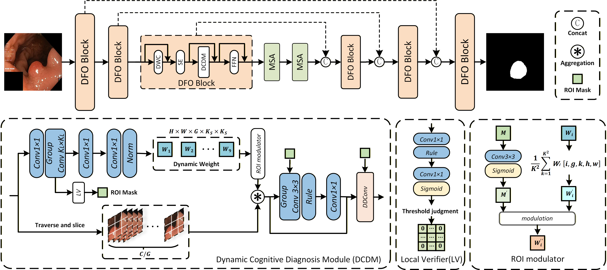

<h2 align="center">✨DGL-UNet: A Diagnosis-Guided Lightweight Network with Direction-Aware Convolutions for Medical Image Segmentation</h2>


<!-- <p align="center">
  <b>Mengqi Lei<sup>1</sup>, Haochen Wu<sup>1</sup>, Xinhua Lv<sup>1</sup>, Xin Wang<sup>2</sup></b>
</p>

<p align="center">
  <sup>1</sup>China University of Geosciences, Wuhan 430074, China<br>
  <sup>2</sup>Baidu Inc, Beijing, China<br>
</p> -->

  <p align="center"> 
  <!-- Contact Badge -->
  <a href="107552404008@stu.xju.edu.cn" target="_blank">
      
  </a>
</p>


## Overview🔍
<div>
    
</div>

**Figure 1. The framework of the proposed DGL-UNet.**


**_Abstract -_** Medical image segmentation remains highly challenging due to the frequent co-occurrence of lesions and anatomical structures, as well as ambiguous and irregular boundaries.This co-occurrence induces severe spatial and semantic entanglement, while conventional convolutions—constrained by fixed geometric kernels—lack the adaptability required to model the irregular contours and fuzzy boundaries inherent in complex pathologies. To overcome these limitations, this study proposes a lightweight diagnosis-inspired visual network to simulate the clinician's triage process. Our framework introduces two key innovations: (1) Dynamic Cognitive Diagnosis Module (DCDM), which adopts a ROI dynamic weight modulation mechanism. This mechanism spatially and adaptively adjusts the dynamic feature weights based on the contextual information unique to the ROI region, thereby achieving targeted enhancement of key lesion features while effectively suppressing the interference response of irrelevant background regions. (2) Direction-Aware Convolution (DAC) module, which learns edge directions through a dynamically rotated kernel group. By adaptively aligning the filter with the irregular contour, DAC significantly improves the boundary representation of fuzzy edges.
Through extensive experiments on four medical image datasets, it is demonstrated that our method achieves state-of-the-art performance and universality.
## Datasets📚
To verify the performance and general applicability of our DGL-UNet in the field of medical image segmentation, we conducted experiments on four challenging public datasets: ISIC-2018, Kvasir, COVID-19, and Moun-Seg, covering subdivision tasks across four modalities. 

| Dataset      | Modality                  | Anatomic Region | Segmentation Target | Data Volume |
|--------------|---------------------------|-----------------|---------------------|-------------|
| Kvasir-SEG   | endoscope                 | colon           | polyp               | 1000        |
| Kvasir-Sessile | endoscope               | colon           | polyp               | 196         |
| GlaS         | whole-slide image (WSI)   | colorectum      | gland               | 165         |
| ISIC-2016    | dermoscope                | skin            | malignant skin lesion | 1279       |
| ISIC-2017    | dermoscope                | skin            | malignant skin lesion | 2750       |

For Kvasir-SEG, we followed the official recommendation, using a split of 880/120 for training and validation. Kvasir-Sessile, a challenging subset of Kvasir-SEG, adopted the widely used split of 156/20/20 for training, validation, and testing as in [TGANet](https://github.com/nikhilroxtomar/TGANet), [TGEDiff](https://www.sciencedirect.com/science/article/pii/S0957417424004147), etc. For GlaS, we used the official split of 85/80 for training and validation. For ISIC-2016, we utilized the official split of 900/379 for training and validation. For ISIC-2017, we also followed the official recommendation, using a split of 2000/150/600 for training, validation and testing.

## Experimental Results🏆

[//]: # (![img.png]&#40;figures/comp_1.png&#41;)

[//]: # (![img.png]&#40;img.png&#41;)

**Table 1. Quantitative comparison of ConDSeg with state-of-the-art methods on Kvasir-Sessile, Kvasir-SEG and GlaS datasets.**
<div>
    
</div>

**Table 2. Quantitative comparison of ConDSeg with state-of-the-art methods on ISIC-2016 and ISIC-2017 datasets.**
<div>
    
</div>

<br> </br>

<div>
    
</div>

**Figure 2. Visualization of results comparing with other methods.**


## Getting Started🚀
### Data Preparation
The dataset should be organised as follows,taking Kvasir-SEG as an example:
```text
Kvasir-SEG
├── images
│   ├── cju0qkwl35piu0993l0dewei2.jpg
│   ├── cju0qoxqj9q6s0835b43399p4.jpg
│   ├── cju0qx73cjw570799j4n5cjze.jpg
│   ├── ...
├── masks
│   ├── cju0qkwl35piu0993l0dewei2.jpg
│   ├── cju0qoxqj9q6s0835b43399p4.jpg
│   ├── cju0qx73cjw570799j4n5cjze.jpg
│   ├── ...
├── train.txt
├── val.txt
```

### Training
- To train the first stage of ConDSeg, run: `train_stage1.py`.
- To train the second stage of ConDSeg, add the weights of the first stage to the `train.py` script and run it.

### Evaluation
- To evaluate the model and generate the prediction results, run: `test.py`.

### Another Version Using Transformer Encoder
If you are interested in the version of ConDSeg that uses the Pyramid Vision Transformer as the Encoder, please see `./network_pvt`.


## Cite our work📝
```bibtex
@article{lei2024condseg,
  title={ConDSeg: A General Medical Image Segmentation Framework via Contrast-Driven Feature Enhancement},
  author={Lei, Mengqi and Wu, Haochen and Lv, Xinhua and Wang, Xin},
  journal={arXiv preprint arXiv:2412.08345},
  year={2024}
}
```

## License📜
The source code is free for research and education use only. Any comercial use should get formal permission first.


